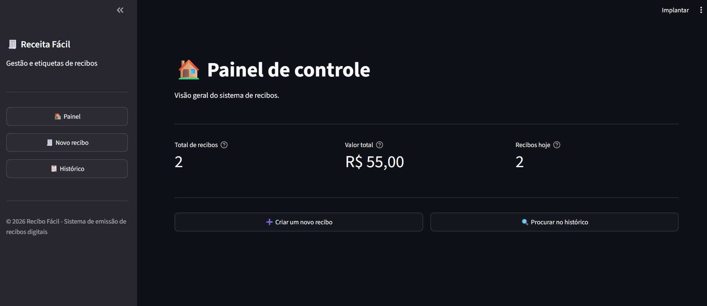
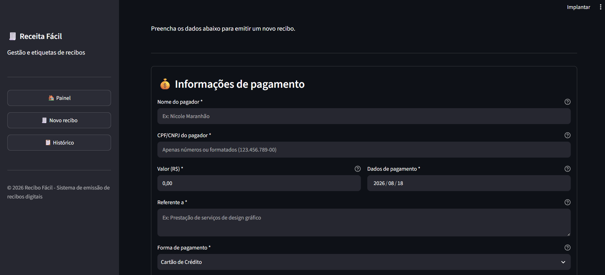
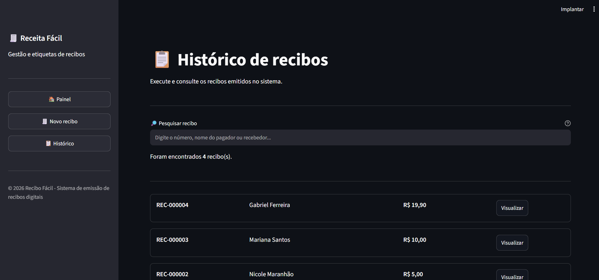
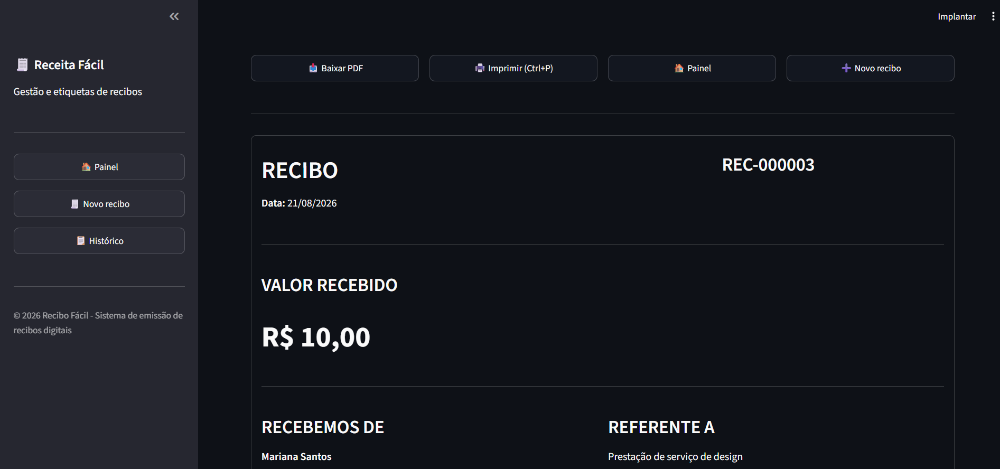

# 🧾 Recibo Fácil

### Plataforma web para emissão e gerenciamento de recibos digitais

O **Recibo Fácil** é uma aplicação web desenvolvida em Python para criar, armazenar, consultar, editar e gerar recibos digitais em PDF.

O projeto foi desenvolvido com o objetivo de praticar, de forma integrada, conceitos de **desenvolvimento web, programação em Python, banco de dados, SQL, validação de dados, geração de documentos, testes automatizados e organização de software**.

A aplicação simula uma plataforma real de gerenciamento de recibos, permitindo acompanhar os documentos criados e acessar seus dados posteriormente.

---

## 📸 Demonstração

### 📊 Painel de controle

Tela principal da aplicação, desenvolvida para facilitar o acesso às funcionalidades do sistema.

### 📝 Cadastro de recibo

Tela utilizada para preencher os dados necessários para emissão de um recibo, incluindo informações do pagador, pagamento e recebedor.

### 📋 Histórico de recibos

Área destinada à consulta dos recibos cadastrados, permitindo pesquisar e localizar documentos emitidos anteriormente.

### 🧾 Recibo gerado

Após o preenchimento e validação dos dados, o sistema apresenta o recibo pronto para visualização, download e impressão.

---

## 🚀 Funcionalidades

### 🧾 Emissão de recibos

- Cadastro de dados do pagador
- Cadastro de dados do recebedor
- CPF/CNPJ
- Valor recebido
- Data do pagamento
- Descrição do pagamento ou serviço
- Forma de pagamento
- Numeração automática dos recibos
- Pré-visualização dos dados

### 🔎 Gerenciamento

- Histórico de recibos
- Pesquisa de recibos
- Consulta de registros
- Visualização de recibos
- Edição de recibos
- Exclusão de registros
- Identificação individual por número de recibo

### 📄 Documentos

- Geração de recibos em PDF
- Layout estruturado para impressão
- Download do documento
- Impressão do recibo
- Organização dos PDFs gerados

### 🛡️ Validação

- Validação de CPF
- Validação de CNPJ
- Validação de campos obrigatórios
- Validação de valores
- Tratamento de campos opcionais
- Tratamento de erros da aplicação

### 🗄️ Persistência

- Banco de dados SQLite
- Armazenamento persistente dos recibos
- Consultas SQL
- Operações CRUD
- Numeração sequencial dos recibos

### 🧪 Qualidade

- Testes automatizados
- Testes de validação
- Testes de banco de dados
- Testes de geração de PDF
- Teste do fluxo completo
- Organização modular do código
- Tratamento de exceções

---

## 🛠️ Tecnologias utilizadas

| Tecnologia   | Utilização                              |
| ------------ | --------------------------------------- |
| 🐍 Python    | Linguagem principal do projeto          |
| 🎨 Streamlit | Desenvolvimento da interface web        |
| 🗄️ SQLite    | Banco de dados relacional               |
| 🔎 SQL       | Consultas e manipulação dos dados       |
| 📄 ReportLab | Geração dos documentos PDF              |
| 🧪 unittest  | Testes automatizados                    |
| 🌐 HTML      | Estrutura e personalização da interface |
| 🎨 CSS       | Estilização da aplicação                |
| 🔧 Git       | Controle de versão                      |
| ☁️ GitHub    | Versionamento e publicação do código    |

---

## 🏗️ Arquitetura da aplicação

O projeto foi dividido em módulos para separar responsabilidades, facilitar a manutenção e permitir a evolução da aplicação.

**Fluxo da aplicação:**

**Usuário → Streamlit → Validações → Banco de dados → Geração de PDF → Download/Impressão**

### Componentes principais

| Componente        | Responsabilidade                            |
| ----------------- | ------------------------------------------- |
| `app.py`          | Interface, formulários e fluxo da aplicação |
| `validacoes.py`   | Validação dos dados                         |
| `formatadores.py` | Formatação de valores, documentos e datas   |
| `database.py`     | Comunicação com o SQLite                    |
| `gerador_pdf.py`  | Geração dos recibos em PDF                  |
| `test_sistema.py` | Testes automatizados                        |

---

## 📁 Estrutura do projeto

- `docs/` — imagens utilizadas na documentação
  - `painelcontrolerecibos.png`
  - `dadospagamentorecibos.png`
  - `historicorecibos.png`
  - `reciborecibos.png`
- `app.py` — aplicação principal
- `database.py` — camada de banco de dados
- `validacoes.py` — validações
- `formatadores.py` — formatação dos dados
- `gerador_pdf.py` — geração de PDF
- `test_sistema.py` — testes automatizados
- `requirements.txt` — dependências
- `README.md` — documentação
- `.gitignore` — arquivos ignorados pelo Git

---

## 📂 Responsabilidade dos arquivos

### `app.py`

Arquivo principal da aplicação.

Responsável por:

- Interface
- Formulários
- Navegação
- Interação com o usuário
- Gerenciamento do fluxo
- Integração dos módulos

### `database.py`

Responsável pela comunicação com o SQLite.

Principais operações:

- Conexão com o banco
- Criação das tabelas
- Inserção de recibos
- Consulta
- Pesquisa
- Atualização
- Exclusão
- Numeração sequencial

### `validacoes.py`

Centraliza as regras de validação.

Responsável por:

- CPF
- CNPJ
- Campos obrigatórios
- Valores
- Dados do formulário

### `formatadores.py`

Responsável pela apresentação padronizada dos dados.

Exemplo:

**1500.50 → R$ 1.500,50**

Também trabalha com:

- Moeda
- CPF
- CNPJ
- Datas
- Valores por extenso

### `gerador_pdf.py`

Responsável pela criação dos recibos em PDF utilizando ReportLab.

O módulo recebe os dados do recibo e gera o documento final para download e impressão.

### `test_sistema.py`

Contém os testes automatizados do sistema.

São testados:

- Validações
- Formatação
- Banco de dados
- CRUD
- Numeração dos recibos
- Geração de PDF
- Fluxo completo de criação

---

## 🗄️ Banco de dados

O projeto utiliza **SQLite**, um banco de dados relacional leve para armazenamento persistente dos recibos.

### Tabela `recibos`

| Campo                 | Tipo      | Descrição              |
| --------------------- | --------- | ---------------------- |
| `id`                  | INTEGER   | Identificador único    |
| `numero_recibo`       | TEXT      | Número do recibo       |
| `pagador_nome`        | TEXT      | Nome do pagador        |
| `pagador_documento`   | TEXT      | CPF/CNPJ do pagador    |
| `valor`               | REAL      | Valor recebido         |
| `data_pagamento`      | TEXT      | Data do pagamento      |
| `descricao`           | TEXT      | Descrição do pagamento |
| `forma_pagamento`     | TEXT      | Forma de pagamento     |
| `recebedor_nome`      | TEXT      | Nome do recebedor      |
| `recebedor_documento` | TEXT      | CPF/CNPJ do recebedor  |
| `data_criacao`        | TIMESTAMP | Data de criação        |
| `caminho_pdf`         | TEXT      | Caminho do PDF         |

---

## 🔐 Validação e segurança

O sistema realiza verificações antes de armazenar os dados.

Entre elas:

- Validação de CPF e CNPJ
- Verificação dos campos obrigatórios
- Validação de valores
- Tratamento de campos opcionais
- Tratamento de exceções
- Consultas SQL parametrizadas

As consultas parametrizadas ajudam a reduzir riscos relacionados à inserção direta de valores nas consultas SQL.

---

## 🧪 Testes automatizados

O projeto possui uma suíte de testes utilizando `unittest`.

As principais áreas testadas são:

- ✅ CPF
- ✅ CNPJ
- ✅ Formulários
- ✅ Valores
- ✅ Datas
- ✅ Formatação
- ✅ Banco de dados
- ✅ CRUD
- ✅ Numeração dos recibos
- ✅ Geração de PDF
- ✅ Fluxo completo

### Executar os testes

`python -m unittest test_sistema -v`

---

## ▶️ Como executar o projeto

### 1. Clonar o repositório

`git clone https://github.com/nicolemaranhao/gerador-recibos.git`

### 2. Entrar na pasta

`cd gerador-recibos`

### 3. Criar o ambiente virtual

`python -m venv .venv`

### 4. Ativar o ambiente virtual

**Windows:**

`.venv\Scripts\activate`

**Linux/macOS:**

`source .venv/bin/activate`

### 5. Instalar as dependências

`pip install -r requirements.txt`

### 6. Executar os testes

`python -m unittest test_sistema -v`

### 7. Executar a aplicação

`streamlit run app.py`

Após executar o comando, a aplicação será disponibilizada pelo Streamlit no navegador.

---

## 🔄 Fluxo principal

**1. Usuário preenche os dados**

↓

**2. Sistema valida as informações**

↓

**3. Dados são armazenados no SQLite**

↓

**4. Número do recibo é gerado**

↓

**5. PDF é criado**

↓

**6. Recibo é disponibilizado**

↓

**7. Usuário pode visualizar, baixar ou imprimir**

---

## 📚 Principais aprendizados

### 🐍 Python

- Funções
- Módulos
- Estruturas de dados
- Tratamento de exceções
- Manipulação de strings
- Organização de código
- Separação de responsabilidades

### 🗄️ Banco de dados

- SQLite
- SQL
- CRUD
- SELECT
- INSERT
- UPDATE
- DELETE
- Filtros
- Persistência

### 🌐 Desenvolvimento web

- Streamlit
- Formulários
- Componentes de interface
- Gerenciamento de estado
- HTML
- CSS

### 📄 Geração de documentos

- ReportLab
- Criação de PDF
- Formatação de documentos
- Organização de arquivos

### 🧪 Testes

- unittest
- Testes unitários
- Testes de integração
- Validação de fluxos
- Identificação de erros

### 🔧 Engenharia de software

- Modularização
- Separação de responsabilidades
- Tratamento de erros
- Organização de projeto
- Git
- GitHub

---

## 💡 Decisões técnicas

### Por que Python?

Python foi utilizado como linguagem principal por sua legibilidade, facilidade de desenvolvimento e grande ecossistema de bibliotecas.

### Por que Streamlit?

O Streamlit permite desenvolver aplicações web utilizando Python, possibilitando construir uma interface funcional de maneira rápida.

### Por que SQLite?

O SQLite fornece um banco de dados relacional leve e adequado para uma aplicação local, sem necessidade de configurar um servidor externo.

### Por que separar os módulos?

A separação permite que cada módulo tenha uma responsabilidade específica, facilitando manutenção, testes, leitura do código e evolução do projeto.

---

## 📈 Possíveis evoluções

- Dashboard com gráficos
- Filtros avançados por período
- Filtros por forma de pagamento
- Exportação para CSV
- Relatórios financeiros
- Backup automático
- Autenticação de usuários
- Controle de permissões
- Multiusuário
- PostgreSQL
- API REST
- Deploy em nuvem
- Tema claro/escuro
- Sistema de auditoria
- Melhorias de acessibilidade

---

## 🔮 Evolução futura

Uma possível evolução da aplicação seria separar frontend e backend, permitindo transformar o projeto em uma solução preparada para múltiplos usuários.

**Arquitetura futura:**

**Frontend Web/Mobile → API → Backend Python → PostgreSQL**

Essa arquitetura permitiria maior escalabilidade, autenticação, controle de permissões, integração com outros sistemas e implantação em ambientes de produção.

---

## 🎯 Objetivo do projeto

O principal objetivo do Recibo Fácil foi transformar conhecimentos teóricos em uma aplicação prática e funcional.

O projeto reúne diferentes áreas do desenvolvimento em uma única aplicação:

**Python + SQL + Banco de Dados + Desenvolvimento Web + Validação + PDF + Testes + Git**

Além de funcionar como aplicação, o projeto também foi utilizado como estudo prático de organização de código, persistência de dados, testes e desenvolvimento de software.

---

## 📌 Status do projeto

**Versão 1.0 — funcional**

Atualmente, o projeto possui:

- ✅ Emissão de recibos
- ✅ Validação de dados
- ✅ Armazenamento em SQLite
- ✅ Histórico
- ✅ Pesquisa
- ✅ Edição
- ✅ Exclusão
- ✅ Geração de PDF
- ✅ Download
- ✅ Impressão
- ✅ Testes automatizados

---

## 👩‍💻 Desenvolvedora

### Nicole Maranhão

Estudante de **Ciência da Computação**, com interesse em:

- 🐍 Python
- 🗄️ SQL
- 📊 Dados
- 🤖 Inteligência Artificial
- 💻 Desenvolvimento de software
- 📈 Business Intelligence

Este projeto faz parte da minha jornada de aprendizado e construção de portfólio na área de tecnologia.

---

## 🔗 Repositório

[GitHub — Recibo Fácil](https://github.com/nicolemaranhao/gerador-recibos)

---

## 📄 Licença

Projeto desenvolvido para fins de aprendizado, portfólio e demonstração de conhecimentos em desenvolvimento de software.
